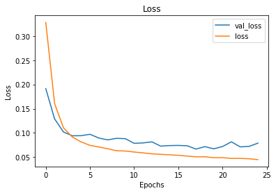
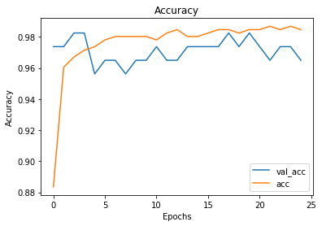
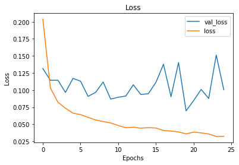
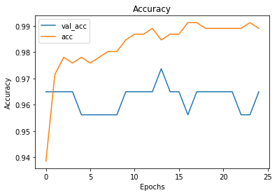
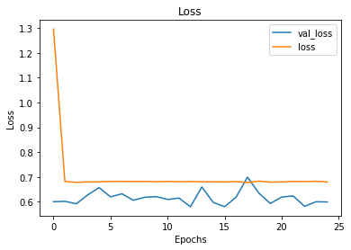
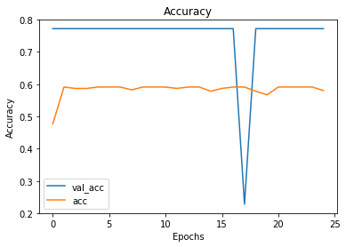

# Deeper Neural Networks - Lab

## Introduction

In this lesson, we'll dig deeper into the work horse of deep learning, **_Multi-Layer Perceptrons_**! We'll build and train a couple different MLPs with Keras and explore the tradeoffs that come with adding extra hidden layers. We'll also try switching out some of the activation functions we learned about in the previous lesson to see how they affect training and performance. 

## Getting Started

We'll begin by importing everything we need for this lab. Run the cell below 
to import everything we'll need for this lab. 


```python
import pandas as pd
import numpy as np
import matplotlib.pyplot as plt
%matplotlib inline
import keras
from keras.models import Sequential
from keras.layers import Dense
# from keras.datasets import boston_housing, mnist
from sklearn.datasets import load_breast_cancer
from sklearn.preprocessing import StandardScaler, LabelBinarizer
```


```python
# __SOLUTION__ 
import pandas as pd
import numpy as np
import matplotlib.pyplot as plt
%matplotlib inline
import keras
from keras.models import Sequential
from keras.layers import Dense
# from keras.datasets import boston_housing, mnist
from sklearn.datasets import load_breast_cancer
from sklearn.preprocessing import StandardScaler, LabelBinarizer
```

    Using TensorFlow backend.


For this lab, we'll be working with the [Boston Breast Cancer Dataset](https://www.kaggle.com/uciml/breast-cancer-wisconsin-data). Although we're importing this dataset directly from sklearn, the kaggle link above contains a detailed explanation of the dataset, in case you're interested. We recommend taking a minute to familiarize yourself with the dataset before digging in. 

In the cell below:

* Call `load_breast_cancer()` to store the dataset object. 
* Get the `.data`, `.target`, and `.feature_names` and store them in the appropriate variables below.


```python
bc_dataset = None
data = None
target = None
col_names = None
```


```python
# __SOLUTION__ 
bc_dataset = load_breast_cancer()
data = bc_dataset.data
target = bc_dataset.target
col_names = bc_dataset.feature_names
```

Now, let's create a dataframe so that we can see the data and explore it a bit more easily with the column names attached. 

In the cell below, create a pandas dataframe and pass in the `data`. Also pass in the `col_names` to the `columns` parameter when creating the dataframe. Then, print the head of the dataframe. 


```python
df = None
# df.head()
```


```python
# __SOLUTION__ 
df = pd.DataFrame(data, columns=col_names)
df.head()
```


<div>
<style scoped>
    .dataframe tbody tr th:only-of-type {
        vertical-align: middle;
    }

    .dataframe tbody tr th {
        vertical-align: top;
    }

    .dataframe thead th {
        text-align: right;
    }
</style>
<table border="1" class="dataframe">
  <thead>
    <tr style="text-align: right;">
      <th></th>
      <th>mean radius</th>
      <th>mean texture</th>
      <th>mean perimeter</th>
      <th>mean area</th>
      <th>mean smoothness</th>
      <th>mean compactness</th>
      <th>mean concavity</th>
      <th>mean concave points</th>
      <th>mean symmetry</th>
      <th>mean fractal dimension</th>
      <th>...</th>
      <th>worst radius</th>
      <th>worst texture</th>
      <th>worst perimeter</th>
      <th>worst area</th>
      <th>worst smoothness</th>
      <th>worst compactness</th>
      <th>worst concavity</th>
      <th>worst concave points</th>
      <th>worst symmetry</th>
      <th>worst fractal dimension</th>
    </tr>
  </thead>
  <tbody>
    <tr>
      <th>0</th>
      <td>17.99</td>
      <td>10.38</td>
      <td>122.80</td>
      <td>1001.0</td>
      <td>0.11840</td>
      <td>0.27760</td>
      <td>0.3001</td>
      <td>0.14710</td>
      <td>0.2419</td>
      <td>0.07871</td>
      <td>...</td>
      <td>25.38</td>
      <td>17.33</td>
      <td>184.60</td>
      <td>2019.0</td>
      <td>0.1622</td>
      <td>0.6656</td>
      <td>0.7119</td>
      <td>0.2654</td>
      <td>0.4601</td>
      <td>0.11890</td>
    </tr>
    <tr>
      <th>1</th>
      <td>20.57</td>
      <td>17.77</td>
      <td>132.90</td>
      <td>1326.0</td>
      <td>0.08474</td>
      <td>0.07864</td>
      <td>0.0869</td>
      <td>0.07017</td>
      <td>0.1812</td>
      <td>0.05667</td>
      <td>...</td>
      <td>24.99</td>
      <td>23.41</td>
      <td>158.80</td>
      <td>1956.0</td>
      <td>0.1238</td>
      <td>0.1866</td>
      <td>0.2416</td>
      <td>0.1860</td>
      <td>0.2750</td>
      <td>0.08902</td>
    </tr>
    <tr>
      <th>2</th>
      <td>19.69</td>
      <td>21.25</td>
      <td>130.00</td>
      <td>1203.0</td>
      <td>0.10960</td>
      <td>0.15990</td>
      <td>0.1974</td>
      <td>0.12790</td>
      <td>0.2069</td>
      <td>0.05999</td>
      <td>...</td>
      <td>23.57</td>
      <td>25.53</td>
      <td>152.50</td>
      <td>1709.0</td>
      <td>0.1444</td>
      <td>0.4245</td>
      <td>0.4504</td>
      <td>0.2430</td>
      <td>0.3613</td>
      <td>0.08758</td>
    </tr>
    <tr>
      <th>3</th>
      <td>11.42</td>
      <td>20.38</td>
      <td>77.58</td>
      <td>386.1</td>
      <td>0.14250</td>
      <td>0.28390</td>
      <td>0.2414</td>
      <td>0.10520</td>
      <td>0.2597</td>
      <td>0.09744</td>
      <td>...</td>
      <td>14.91</td>
      <td>26.50</td>
      <td>98.87</td>
      <td>567.7</td>
      <td>0.2098</td>
      <td>0.8663</td>
      <td>0.6869</td>
      <td>0.2575</td>
      <td>0.6638</td>
      <td>0.17300</td>
    </tr>
    <tr>
      <th>4</th>
      <td>20.29</td>
      <td>14.34</td>
      <td>135.10</td>
      <td>1297.0</td>
      <td>0.10030</td>
      <td>0.13280</td>
      <td>0.1980</td>
      <td>0.10430</td>
      <td>0.1809</td>
      <td>0.05883</td>
      <td>...</td>
      <td>22.54</td>
      <td>16.67</td>
      <td>152.20</td>
      <td>1575.0</td>
      <td>0.1374</td>
      <td>0.2050</td>
      <td>0.4000</td>
      <td>0.1625</td>
      <td>0.2364</td>
      <td>0.07678</td>
    </tr>
  </tbody>
</table>
<p>5 rows × 30 columns</p>
</div>


## Getting the Data Ready for Deep Learning

In order to pass this data into a neural network, we'll need to make sure that the data:

* Is purely numerical
* contains no null values
* Is normalized 

Let's begin by calling the dataframe's `.info()` method to check the datatype of each feature. 


```python

```


```python
# __SOLUTION__ 
df.info()
```

    <class 'pandas.core.frame.DataFrame'>
    RangeIndex: 569 entries, 0 to 568
    Data columns (total 30 columns):
    mean radius                569 non-null float64
    mean texture               569 non-null float64
    mean perimeter             569 non-null float64
    mean area                  569 non-null float64
    mean smoothness            569 non-null float64
    mean compactness           569 non-null float64
    mean concavity             569 non-null float64
    mean concave points        569 non-null float64
    mean symmetry              569 non-null float64
    mean fractal dimension     569 non-null float64
    radius error               569 non-null float64
    texture error              569 non-null float64
    perimeter error            569 non-null float64
    area error                 569 non-null float64
    smoothness error           569 non-null float64
    compactness error          569 non-null float64
    concavity error            569 non-null float64
    concave points error       569 non-null float64
    symmetry error             569 non-null float64
    fractal dimension error    569 non-null float64
    worst radius               569 non-null float64
    worst texture              569 non-null float64
    worst perimeter            569 non-null float64
    worst area                 569 non-null float64
    worst smoothness           569 non-null float64
    worst compactness          569 non-null float64
    worst concavity            569 non-null float64
    worst concave points       569 non-null float64
    worst symmetry             569 non-null float64
    worst fractal dimension    569 non-null float64
    dtypes: float64(30)
    memory usage: 133.4 KB


From the output above, we can see that the entire dataset is already in numerical format. We can also see from the counts that each feature has the same number of entries as the number of rows in the dataframe--that means that no feature contains any null values. Great!

Now, let's check to see if our data needs to be normalized. Instead of doing statistical tests here, let's just take a quick look at the head of the dataframe again. Do this in the cell below. 


```python

```


```python
# __SOLUTION__ 
df.head()
```


<div>
<style scoped>
    .dataframe tbody tr th:only-of-type {
        vertical-align: middle;
    }

    .dataframe tbody tr th {
        vertical-align: top;
    }

    .dataframe thead th {
        text-align: right;
    }
</style>
<table border="1" class="dataframe">
  <thead>
    <tr style="text-align: right;">
      <th></th>
      <th>mean radius</th>
      <th>mean texture</th>
      <th>mean perimeter</th>
      <th>mean area</th>
      <th>mean smoothness</th>
      <th>mean compactness</th>
      <th>mean concavity</th>
      <th>mean concave points</th>
      <th>mean symmetry</th>
      <th>mean fractal dimension</th>
      <th>...</th>
      <th>worst radius</th>
      <th>worst texture</th>
      <th>worst perimeter</th>
      <th>worst area</th>
      <th>worst smoothness</th>
      <th>worst compactness</th>
      <th>worst concavity</th>
      <th>worst concave points</th>
      <th>worst symmetry</th>
      <th>worst fractal dimension</th>
    </tr>
  </thead>
  <tbody>
    <tr>
      <th>0</th>
      <td>17.99</td>
      <td>10.38</td>
      <td>122.80</td>
      <td>1001.0</td>
      <td>0.11840</td>
      <td>0.27760</td>
      <td>0.3001</td>
      <td>0.14710</td>
      <td>0.2419</td>
      <td>0.07871</td>
      <td>...</td>
      <td>25.38</td>
      <td>17.33</td>
      <td>184.60</td>
      <td>2019.0</td>
      <td>0.1622</td>
      <td>0.6656</td>
      <td>0.7119</td>
      <td>0.2654</td>
      <td>0.4601</td>
      <td>0.11890</td>
    </tr>
    <tr>
      <th>1</th>
      <td>20.57</td>
      <td>17.77</td>
      <td>132.90</td>
      <td>1326.0</td>
      <td>0.08474</td>
      <td>0.07864</td>
      <td>0.0869</td>
      <td>0.07017</td>
      <td>0.1812</td>
      <td>0.05667</td>
      <td>...</td>
      <td>24.99</td>
      <td>23.41</td>
      <td>158.80</td>
      <td>1956.0</td>
      <td>0.1238</td>
      <td>0.1866</td>
      <td>0.2416</td>
      <td>0.1860</td>
      <td>0.2750</td>
      <td>0.08902</td>
    </tr>
    <tr>
      <th>2</th>
      <td>19.69</td>
      <td>21.25</td>
      <td>130.00</td>
      <td>1203.0</td>
      <td>0.10960</td>
      <td>0.15990</td>
      <td>0.1974</td>
      <td>0.12790</td>
      <td>0.2069</td>
      <td>0.05999</td>
      <td>...</td>
      <td>23.57</td>
      <td>25.53</td>
      <td>152.50</td>
      <td>1709.0</td>
      <td>0.1444</td>
      <td>0.4245</td>
      <td>0.4504</td>
      <td>0.2430</td>
      <td>0.3613</td>
      <td>0.08758</td>
    </tr>
    <tr>
      <th>3</th>
      <td>11.42</td>
      <td>20.38</td>
      <td>77.58</td>
      <td>386.1</td>
      <td>0.14250</td>
      <td>0.28390</td>
      <td>0.2414</td>
      <td>0.10520</td>
      <td>0.2597</td>
      <td>0.09744</td>
      <td>...</td>
      <td>14.91</td>
      <td>26.50</td>
      <td>98.87</td>
      <td>567.7</td>
      <td>0.2098</td>
      <td>0.8663</td>
      <td>0.6869</td>
      <td>0.2575</td>
      <td>0.6638</td>
      <td>0.17300</td>
    </tr>
    <tr>
      <th>4</th>
      <td>20.29</td>
      <td>14.34</td>
      <td>135.10</td>
      <td>1297.0</td>
      <td>0.10030</td>
      <td>0.13280</td>
      <td>0.1980</td>
      <td>0.10430</td>
      <td>0.1809</td>
      <td>0.05883</td>
      <td>...</td>
      <td>22.54</td>
      <td>16.67</td>
      <td>152.20</td>
      <td>1575.0</td>
      <td>0.1374</td>
      <td>0.2050</td>
      <td>0.4000</td>
      <td>0.1625</td>
      <td>0.2364</td>
      <td>0.07678</td>
    </tr>
  </tbody>
</table>
<p>5 rows × 30 columns</p>
</div>


As we can clearly see from comparing features like `mean radius` and `mean area`, columns have different scales, which means that we need to normalize our dataset. To do this, we'll make use of sklearn's `StandardScaler()` object. 

In the cell below, use create a StandardScaler object and use it to create a normalized version of our dataset. 


```python
scaler = None
scaled_data = None
```


```python
# __SOLUTION__ 
scaler = StandardScaler()
scaled_data = scaler.fit_transform(data)
```

## Binarizing Our Labels

If you took a look at the data dictionary on Kaggle, then you probably noticed the target for this dataset is to predict if the sample is "M" (Malignant) or "B" (Benign). This means that this is a **_Binary Classification_** task, so we'll need to binarize our labels. 

In the cell below, make use of sklearn's `LabelBinarizer()` object to create a binarized version of our labels. 


```python
binarizer = None
labels = None
```


```python
# __SOLUTION__ 
binarizer = LabelBinarizer()
labels = binarizer.fit_transform(target)
```

## Building our MLP

Now, we'll build a small **_Multi-Layer Perceptron_** using Keras in the cell below. Our first model will act as a baseline, and then we'll make it bigger to see what happens to model performance. 

In the cell below:

* Create our keras model by instantiating a `Sequential()` object. 
* Use the model's `.add()` method to add a `Dense` layer with 10 neurons and a `'tanh'` activation function. Also set the `input_shape` attribute to `(30,)`, since we have 30 features. 
* Since this is a binary classification task, the output layer should be a `Dense` layer with a single neuron, and the activation set to `'sigmoid'`.


```python
model_1 = None

```


```python
# __SOLUTION__ 
model_1 = Sequential()
model_1.add(Dense(5, activation='tanh', input_shape=(30,)))
model_1.add(Dense(1, activation='sigmoid'))
```

### Compiling the Model

Now that we've created the model, we still have to compile it. 

In the cell below, compile the model. Set the following hyperparameters:

* `loss='binary_crossentropy'`
* `optimizer='sgd'`
* `metrics=['accuracy']`


```python

```


```python
# __SOLUTION__ 
model_1.compile(loss='binary_crossentropy', optimizer='sgd', metrics=['accuracy'])
```

### Fitting the Model

Now, let's fit the model. In addition to our scaled data and our labels, set the following hyperparameters:

* `epochs=25`
* `batch_size=1`
* `validation_split=0.2`


```python
results_1 = None
```


```python
# __SOLUTION__ 
results_1 = model_1.fit(scaled_data, labels, epochs=25, batch_size=1, validation_split=0.2)
```

    Train on 455 samples, validate on 114 samples
    Epoch 1/25
    455/455 [==============================] - 5s 11ms/step - loss: 0.3280 - acc: 0.8835 - val_loss: 0.1913 - val_acc: 0.9737
    Epoch 2/25
    455/455 [==============================] - 1s 3ms/step - loss: 0.1603 - acc: 0.9604 - val_loss: 0.1289 - val_acc: 0.9737
    Epoch 3/25
    455/455 [==============================] - 1s 3ms/step - loss: 0.1105 - acc: 0.9670 - val_loss: 0.1019 - val_acc: 0.9825
    Epoch 4/25
    455/455 [==============================] - 1s 3ms/step - loss: 0.0916 - acc: 0.9714 - val_loss: 0.0941 - val_acc: 0.9825
    Epoch 5/25
    455/455 [==============================] - 1s 3ms/step - loss: 0.0814 - acc: 0.9736 - val_loss: 0.0943 - val_acc: 0.9561
    Epoch 6/25
    455/455 [==============================] - 1s 3ms/step - loss: 0.0743 - acc: 0.9780 - val_loss: 0.0971 - val_acc: 0.9649
    Epoch 7/25
    455/455 [==============================] - 1s 3ms/step - loss: 0.0710 - acc: 0.9802 - val_loss: 0.0895 - val_acc: 0.9649
    Epoch 8/25
    455/455 [==============================] - 1s 3ms/step - loss: 0.0673 - acc: 0.9802 - val_loss: 0.0856 - val_acc: 0.9561
    Epoch 9/25
    455/455 [==============================] - 1s 3ms/step - loss: 0.0632 - acc: 0.9802 - val_loss: 0.0888 - val_acc: 0.9649
    Epoch 10/25
    455/455 [==============================] - 1s 3ms/step - loss: 0.0627 - acc: 0.9802 - val_loss: 0.0881 - val_acc: 0.9649
    Epoch 11/25
    455/455 [==============================] - 1s 3ms/step - loss: 0.0606 - acc: 0.9780 - val_loss: 0.0785 - val_acc: 0.9737
    Epoch 12/25
    455/455 [==============================] - 1s 3ms/step - loss: 0.0588 - acc: 0.9824 - val_loss: 0.0794 - val_acc: 0.9649
    Epoch 13/25
    455/455 [==============================] - 1s 3ms/step - loss: 0.0569 - acc: 0.9846 - val_loss: 0.0815 - val_acc: 0.9649
    Epoch 14/25
    455/455 [==============================] - 1s 3ms/step - loss: 0.0558 - acc: 0.9802 - val_loss: 0.0727 - val_acc: 0.9737
    Epoch 15/25
    455/455 [==============================] - 1s 3ms/step - loss: 0.0548 - acc: 0.9802 - val_loss: 0.0739 - val_acc: 0.9737
    Epoch 16/25
    455/455 [==============================] - 1s 3ms/step - loss: 0.0538 - acc: 0.9824 - val_loss: 0.0742 - val_acc: 0.9737
    Epoch 17/25
    455/455 [==============================] - 1s 3ms/step - loss: 0.0522 - acc: 0.9846 - val_loss: 0.0735 - val_acc: 0.9737
    Epoch 18/25
    455/455 [==============================] - 1s 3ms/step - loss: 0.0507 - acc: 0.9846 - val_loss: 0.0666 - val_acc: 0.9825
    Epoch 19/25
    455/455 [==============================] - 1s 3ms/step - loss: 0.0508 - acc: 0.9824 - val_loss: 0.0717 - val_acc: 0.9737
    Epoch 20/25
    455/455 [==============================] - 1s 3ms/step - loss: 0.0489 - acc: 0.9846 - val_loss: 0.0672 - val_acc: 0.9825
    Epoch 21/25
    455/455 [==============================] - 1s 3ms/step - loss: 0.0489 - acc: 0.9846 - val_loss: 0.0719 - val_acc: 0.9737
    Epoch 22/25
    455/455 [==============================] - 1s 3ms/step - loss: 0.0474 - acc: 0.9868 - val_loss: 0.0816 - val_acc: 0.9649
    Epoch 23/25
    455/455 [==============================] - 1s 3ms/step - loss: 0.0474 - acc: 0.9846 - val_loss: 0.0712 - val_acc: 0.9737
    Epoch 24/25
    455/455 [==============================] - 1s 3ms/step - loss: 0.0467 - acc: 0.9868 - val_loss: 0.0722 - val_acc: 0.9737
    Epoch 25/25
    455/455 [==============================] - 1s 3ms/step - loss: 0.0449 - acc: 0.9846 - val_loss: 0.0789 - val_acc: 0.9649


Let's quickly plot our validation and accuracy curves and see if we notice anything. Note that when you call a Keras model's `.fit()` method, it returns a Keras callback containing information on the training process of the model. If you examine the callback's `.history` attribute, you'll find a dictionary containing both the training and validation loss, as well as any metrics we specified when compiling the model (in this case, just accuracy). 

In the cell below, let's quickly create a function for visualizing the loss and accuracy metrics. Since we'll want to do this anytime we train an MLP, its worth wrapping this code in a function so that we can easily reuse it. 


```python
def visualize_training_results(results):
    history = results.history
    plt.figure()
    plt.plot(history['val_loss'])
    plt.plot(history['loss'])
    plt.legend(['val_loss', 'loss'])
    plt.title('Loss')
    plt.xlabel('Epochs')
    plt.ylabel('Loss')
    plt.show()
    
    plt.figure()
    plt.plot(history['val_acc'])
    plt.plot(history['acc'])
    plt.legend(['val_acc', 'acc'])
    plt.title('Accuracy')
    plt.xlabel('Epochs')
    plt.ylabel('Accuracy')
    plt.show()
```


```python
# __SOLUTION__ 
def visualize_training_results(results):
    history = results.history
    plt.figure()
    plt.plot(history['val_loss'])
    plt.plot(history['loss'])
    plt.legend(['val_loss', 'loss'])
    plt.title('Loss')
    plt.xlabel('Epochs')
    plt.ylabel('Loss')
    plt.show()
    
    plt.figure()
    plt.plot(history['val_acc'])
    plt.plot(history['acc'])
    plt.legend(['val_acc', 'acc'])
    plt.title('Accuracy')
    plt.xlabel('Epochs')
    plt.ylabel('Accuracy')
    plt.show()
```


```python
visualize_training_results(results_1)
```


```python
# __SOLUTION__ 
visualize_training_results(results_1)
```








## Detecting Overfitting

You'll probably notice that the model did pretty well! It's always recommended to visualize your training and validation metrics against each other after training a model. By plotting them like this, we can easily detect that the model is starting to overfit. We can tell that this is happening by seeing the model's training performance steadily improve long after the validation performance plateaus. We can see that in the plots above as the training loss continues to decrease and the training accuracy continues to increase, and the distance between the two lines gets greater as the epochs gets higher. 

## Iterating on the Model

By adding another hidden layer, we can a given the model the ability to capture high layers of abstraction in th data. However, increasing the depth of the model also increases the amount of data the model needs to converge to answer, because with a more complex model comes the "Curse of Dimensionality", thanks to all the extra trainable parameters that come from adding more size to our network. 

If there is complexity in the data that our smaller model was not big enough to catch, then a larger model may improve performance. However, if our dataset isn't big enough for the new, larger model, then we may see performance decrease as then model "thrashes" about a bit, failing to converge. Let's try and see what happens. 

In the cell below, recreate the model that you created above, with one exception. In the model below, add a second `Dense` layer with `'tanh'` activation functions and `5` neurons after the first. The network's output layer should still be a `Dense` layer with a single neuron and a sigmoid activation function, since this is still a binary classification task. 

Create, compile, and fit the model in the cells below, and then visualize the results to compare the history. 


```python
model_2 = None

```


```python
# __SOLUTION__ 
model_2 = Sequential()
model_2.add(Dense(10, activation='tanh', input_shape=(30,)))
model_2.add(Dense(5, activation='tanh'))
model_2.add(Dense(1, activation='sigmoid'))
```


```python

```


```python
# __SOLUTION__ 
model_2.compile(loss='binary_crossentropy', optimizer='sgd', metrics=['accuracy'])
```


```python
results_2 = None
```


```python
# __SOLUTION__ 
results_2 = model_2.fit(scaled_data, labels, epochs=25, batch_size=1, validation_split=0.2)
```

    Train on 455 samples, validate on 114 samples
    Epoch 1/25
    455/455 [==============================] - 2s 3ms/step - loss: 0.2039 - acc: 0.9385 - val_loss: 0.1316 - val_acc: 0.9649
    Epoch 2/25
    455/455 [==============================] - 1s 3ms/step - loss: 0.1032 - acc: 0.9714 - val_loss: 0.1144 - val_acc: 0.9649
    Epoch 3/25
    455/455 [==============================] - 1s 3ms/step - loss: 0.0823 - acc: 0.9780 - val_loss: 0.1145 - val_acc: 0.9649
    Epoch 4/25
    455/455 [==============================] - 1s 3ms/step - loss: 0.0735 - acc: 0.9758 - val_loss: 0.0967 - val_acc: 0.9649
    Epoch 5/25
    455/455 [==============================] - 1s 3ms/step - loss: 0.0663 - acc: 0.9780 - val_loss: 0.1172 - val_acc: 0.9561
    Epoch 6/25
    455/455 [==============================] - 1s 3ms/step - loss: 0.0641 - acc: 0.9758 - val_loss: 0.1131 - val_acc: 0.9561
    Epoch 7/25
    455/455 [==============================] - 1s 3ms/step - loss: 0.0602 - acc: 0.9780 - val_loss: 0.0908 - val_acc: 0.9561
    Epoch 8/25
    455/455 [==============================] - 1s 3ms/step - loss: 0.0562 - acc: 0.9802 - val_loss: 0.0967 - val_acc: 0.9561
    Epoch 9/25
    455/455 [==============================] - 1s 3ms/step - loss: 0.0540 - acc: 0.9802 - val_loss: 0.1119 - val_acc: 0.9561
    Epoch 10/25
    455/455 [==============================] - 1s 3ms/step - loss: 0.0519 - acc: 0.9846 - val_loss: 0.0869 - val_acc: 0.9649
    Epoch 11/25
    455/455 [==============================] - 1s 3ms/step - loss: 0.0482 - acc: 0.9868 - val_loss: 0.0896 - val_acc: 0.9649
    Epoch 12/25
    455/455 [==============================] - 1s 3ms/step - loss: 0.0450 - acc: 0.9868 - val_loss: 0.0912 - val_acc: 0.9649
    Epoch 13/25
    455/455 [==============================] - 1s 3ms/step - loss: 0.0457 - acc: 0.9890 - val_loss: 0.1078 - val_acc: 0.9649
    Epoch 14/25
    455/455 [==============================] - 1s 3ms/step - loss: 0.0443 - acc: 0.9846 - val_loss: 0.0935 - val_acc: 0.9737
    Epoch 15/25
    455/455 [==============================] - 1s 3ms/step - loss: 0.0450 - acc: 0.9868 - val_loss: 0.0948 - val_acc: 0.9649
    Epoch 16/25
    455/455 [==============================] - 1s 3ms/step - loss: 0.0445 - acc: 0.9868 - val_loss: 0.1113 - val_acc: 0.9649
    Epoch 17/25
    455/455 [==============================] - 1s 3ms/step - loss: 0.0409 - acc: 0.9912 - val_loss: 0.1378 - val_acc: 0.9561
    Epoch 18/25
    455/455 [==============================] - 1s 3ms/step - loss: 0.0401 - acc: 0.9912 - val_loss: 0.0904 - val_acc: 0.9649
    Epoch 19/25
    455/455 [==============================] - 1s 3ms/step - loss: 0.0388 - acc: 0.9890 - val_loss: 0.1404 - val_acc: 0.9649
    Epoch 20/25
    455/455 [==============================] - 1s 3ms/step - loss: 0.0359 - acc: 0.9890 - val_loss: 0.0696 - val_acc: 0.9649
    Epoch 21/25
    455/455 [==============================] - 1s 3ms/step - loss: 0.0385 - acc: 0.9890 - val_loss: 0.0846 - val_acc: 0.9649
    Epoch 22/25
    455/455 [==============================] - 1s 3ms/step - loss: 0.0374 - acc: 0.9890 - val_loss: 0.1010 - val_acc: 0.9649
    Epoch 23/25
    455/455 [==============================] - 1s 3ms/step - loss: 0.0358 - acc: 0.9890 - val_loss: 0.0878 - val_acc: 0.9561
    Epoch 24/25
    455/455 [==============================] - 1s 3ms/step - loss: 0.0321 - acc: 0.9912 - val_loss: 0.1513 - val_acc: 0.9561
    Epoch 25/25
    455/455 [==============================] - 1s 3ms/step - loss: 0.0324 - acc: 0.9890 - val_loss: 0.1006 - val_acc: 0.9649


```python
visualize_training_results(results_2)
```


```python
# __SOLUTION__ 
visualize_training_results(results_2)
```








## What Happened?

Although the final validation score for both models is the same, this model is clearly worse because it hasn't converged yet. We can tell because of the greater variance in the movement of the `val_loss` and `val_acc` lines. This suggests that we can remedy this in 1 of 2 ways:

* Decrease the size of the network, OR
* Increase the size of our training data. 

## Visualizing Why we Normalize Our Data

As a final exercise, let's create a 3rd model that is the same as the first model we created for this exercise in every way. The only difference is that we will train it on our raw dataset, not the normalized version. This way, we can see how much of a difference normalizing our input data makes.

Create, compile, and fit a model in the cell below. The only change in parameters will be using `data` instead of `scaled_data` during the `.fit()` step. 


```python
model_3 = None

```


```python
# __SOLUTION__ 
model_3 = Sequential()
model_3.add(Dense(5, activation='tanh', input_shape=(30,)))
model_3.add(Dense(1, activation='sigmoid'))
```


```python

```


```python
# __SOLUTION__ 
model_3.compile(loss='binary_crossentropy', optimizer='sgd', metrics=['accuracy'])
```


```python
results_3 = None
```


```python
# __SOLUTION__ 
results_3 = model_3.fit(data, labels, epochs=25, batch_size=1, validation_split=0.2)
```

    Train on 455 samples, validate on 114 samples
    Epoch 1/25
    455/455 [==============================] - 1s 3ms/step - loss: 1.2957 - acc: 0.4769 - val_loss: 0.6003 - val_acc: 0.7719
    Epoch 2/25
    455/455 [==============================] - 1s 3ms/step - loss: 0.6821 - acc: 0.5912 - val_loss: 0.6020 - val_acc: 0.7719
    Epoch 3/25
    455/455 [==============================] - 1s 3ms/step - loss: 0.6783 - acc: 0.5868 - val_loss: 0.5920 - val_acc: 0.7719
    Epoch 4/25
    455/455 [==============================] - 1s 3ms/step - loss: 0.6800 - acc: 0.5868 - val_loss: 0.6279 - val_acc: 0.7719
    Epoch 5/25
    455/455 [==============================] - 1s 3ms/step - loss: 0.6803 - acc: 0.5912 - val_loss: 0.6573 - val_acc: 0.7719
    Epoch 6/25
    455/455 [==============================] - 1s 3ms/step - loss: 0.6822 - acc: 0.5912 - val_loss: 0.6198 - val_acc: 0.7719
    Epoch 7/25
    455/455 [==============================] - 1s 3ms/step - loss: 0.6822 - acc: 0.5912 - val_loss: 0.6324 - val_acc: 0.7719
    Epoch 8/25
    455/455 [==============================] - 1s 3ms/step - loss: 0.6818 - acc: 0.5824 - val_loss: 0.6062 - val_acc: 0.7719
    Epoch 9/25
    455/455 [==============================] - 1s 3ms/step - loss: 0.6821 - acc: 0.5912 - val_loss: 0.6183 - val_acc: 0.7719
    Epoch 10/25
    455/455 [==============================] - 1s 3ms/step - loss: 0.6808 - acc: 0.5912 - val_loss: 0.6209 - val_acc: 0.7719
    Epoch 11/25
    455/455 [==============================] - 1s 3ms/step - loss: 0.6819 - acc: 0.5912 - val_loss: 0.6094 - val_acc: 0.7719
    Epoch 12/25
    455/455 [==============================] - 1s 3ms/step - loss: 0.6809 - acc: 0.5868 - val_loss: 0.6151 - val_acc: 0.7719
    Epoch 13/25
    455/455 [==============================] - 1s 3ms/step - loss: 0.6813 - acc: 0.5912 - val_loss: 0.5801 - val_acc: 0.7719
    Epoch 14/25
    455/455 [==============================] - 1s 3ms/step - loss: 0.6808 - acc: 0.5912 - val_loss: 0.6598 - val_acc: 0.7719
    Epoch 15/25
    455/455 [==============================] - 1s 3ms/step - loss: 0.6808 - acc: 0.5780 - val_loss: 0.5975 - val_acc: 0.7719
    Epoch 16/25
    455/455 [==============================] - 1s 3ms/step - loss: 0.6800 - acc: 0.5868 - val_loss: 0.5805 - val_acc: 0.7719
    Epoch 17/25
    455/455 [==============================] - 1s 3ms/step - loss: 0.6814 - acc: 0.5912 - val_loss: 0.6188 - val_acc: 0.7719
    Epoch 18/25
    455/455 [==============================] - 1s 3ms/step - loss: 0.6776 - acc: 0.5912 - val_loss: 0.6993 - val_acc: 0.2281
    Epoch 19/25
    455/455 [==============================] - 1s 3ms/step - loss: 0.6832 - acc: 0.5780 - val_loss: 0.6348 - val_acc: 0.7719
    Epoch 20/25
    455/455 [==============================] - 1s 3ms/step - loss: 0.6791 - acc: 0.5670 - val_loss: 0.5936 - val_acc: 0.7719
    Epoch 21/25
    455/455 [==============================] - 1s 3ms/step - loss: 0.6801 - acc: 0.5912 - val_loss: 0.6192 - val_acc: 0.7719
    Epoch 22/25
    455/455 [==============================] - 1s 3ms/step - loss: 0.6822 - acc: 0.5912 - val_loss: 0.6238 - val_acc: 0.7719
    Epoch 23/25
    455/455 [==============================] - 1s 3ms/step - loss: 0.6813 - acc: 0.5912 - val_loss: 0.5817 - val_acc: 0.7719
    Epoch 24/25
    455/455 [==============================] - 1s 3ms/step - loss: 0.6828 - acc: 0.5912 - val_loss: 0.6002 - val_acc: 0.7719
    Epoch 25/25
    455/455 [==============================] - 1s 3ms/step - loss: 0.6798 - acc: 0.5802 - val_loss: 0.5994 - val_acc: 0.7719


```python
visualize_training_results(results_3)
```


```python
# __SOLUTION__ 
visualize_training_results(results_3)
```








Wow! Our results were much worse--over 20% poorer performance when working with non-normalized input data!  


## Summary

In this lab, we got some practice creating **_Multi-Layer Perceptrons_**, and explored how things like the number of layers in a model and data normalization affect our overall training results!
